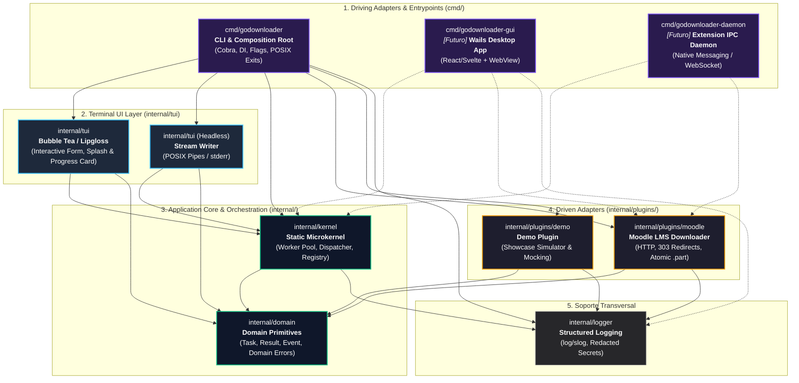

# Arquitectura de GoDownloader (v1.1.x)

Documento de referencia técnica sobre la arquitectura modular, el flujo de dependencias y las pautas de extensibilidad del proyecto `GoDownloader`.

---

## 1. Resumen Ejecutivo y Visión General

`GoDownloader` está estructurado bajo un patrón de **Monolito Modular con Microkernel Estático** inspirado en la **Arquitectura Hexagonal (Puertos y Adaptadores)**.

El objetivo central de la arquitectura es mantener el **motor de descargas (Kernel y Dominio) estrictamente desacoplado de las interfaces de usuario** (TUI interactivo, modos por tuberías POSIX, futuras extensiones de navegador y aplicaciones de escritorio).

### Principios Rectores:
1. **Unidireccionalidad de Dependencias (DAG):** Las dependencias en tiempo de compilación fluyen hacia adentro (hacia el núcleo del dominio). No existen ciclos de importación ni dependencias cruzadas entre adaptadores.
2. **Inversión de Control (IoC):** El punto de entrada (`cmd/`) actúa como *Composition Root*, orquestando la inyección de dependencias (`plugins`, `logger`, configuración) hacia el `kernel`.
3. **Consumer-Driven Interfaces:** En estricto apego a la filosofía de Go (*"Accept interfaces, return structs"*), las interfaces pertenecen al consumidor (quien las invoca), no al productor.
4. **Flujo de Eventos Reactivo:** La comunicación entre el motor y la capa de presentación se realiza mediante callbacks funcionales y eventos atómicos inmutables, garantizando la seguridad en entornos concurrentes.

---

## 2. Diagrama de Dependencias y Topología del Sistema

El siguiente diagrama modela la relación entre los paquetes actuales y los puntos de extensión futuros:

---

## 3. Análisis de Capas y Flujo de Datos

### 3.1. Composition Root (`cmd/godownloader`)
- Es el único componente con visibilidad global de todos los paquetes.
- Configura flags POSIX mediante `spf13/cobra`.
- Detecta si la sesión se ejecuta en una terminal interactiva (TTY) o en modo headless (pipes/CI).
- Instancia y registra los plugins concretos en el `Registry`.
- Inicializa el `Kernel` y delega la ejecución a la interfaz adecuada (`tui.RunProgressUI` o `tui.RunHeadlessProgress`).
- Mapea errores de dominio a códigos de salida POSIX estándar (`0`, `1`, `2`, `77`, `130`).

### 3.2. Microkernel y Orquestación (`internal/kernel`)
- **Agnóstico de presentación y de transporte:** No tiene dependencias de terminal (`bubbletea`, `lipgloss`), I/O estándar, ni clientes HTTP concretos.
- **Worker Pool Acotado:** Implementa un semáforo basado en canales (`chan struct{}`) para limitar estrictamente la concurrencia máxima a nivel de goroutine.
- **Dispatcher & Registry:** Resuelve la URL contra los plugins registrados mediante el método `CanHandle(url)`.
- **Circuit Breaker de Autenticación:** Detecta errores no recuperables (`domain.FatalAuthError` o `domain.ErrAuthenticationFailed`) y cancela inmediatamente el contexto del lote completo para proteger la cuenta del usuario de bloqueos por reintentos masivos.

### 3.3. Dominio (`internal/domain`)
- Contiene los modelos puros y tipos de valor sin lógica externa:
  - `Task`: Parámetros de una unidad individual de descarga.
  - `Result`: Resultado final, bytes transferidos y posibles errores.
  - `Event` / `EventType`: Notificaciones atómicas de transición de estado.
  - `ProgressUpdate`: Estructura para telemetría de streaming.
  - `ErrAuthenticationFailed` e interfaz `FatalAuthError`.

### 3.4. Adaptadores de Descarga (`internal/plugins/*`)
- Implementan el contrato esperado por el Kernel para plataformas específicas.
- `moodle`: Resuelve descargas autenticadas con cookies, gestión de redirecciones HTTP 303, timeouts de inactividad y persistencia atómica mediante archivos temporales `.godownload.part`.
- `demo`: Simulación determinista con fluctuaciones de latencia y tamaños de archivo para showcases y pruebas automatizadas.
- **Totalmente desacoplados entre sí y de la UI.**

### 3.5. Capa de Presentación de Terminal (`internal/tui`)
- Centraliza toda la interacción con el usuario en terminal:
  - Formulario interactivo con `huh`.
  - Pantalla splash inicial.
  - Vista reactiva de progreso en tarjeta con Bubble Tea (`tea.Model`) y Lipgloss (soporte `NO_COLOR` y paletas adaptativas).
  - Ejecución en texto plano headless para tuberías Unix (`RunHeadlessProgress`).

---

## 4. Estrategia de Extensibilidad (Future-Proofing)

La separación en capas permite soportar múltiples consumidores sin alterar el código del motor ni de los plugins:

### 4.1. Automatización en CI/CD y Tuberías Unix
- El motor opera nativamente sin terminal mediante descriptores no TTY o el flag `--headless`.
- La información de progreso se envía a `stderr`, dejando `stdout` disponible para canalizar nombres de archivos o salidas JSON.
- Los códigos de salida (`sysexits`) permiten control de flujo condicional en pipelines de bash/GitHub Actions.

### 4.2. Extensión de Navegador (WebExtensions)
- Se habilitará mediante un ejecutable daemon o *Native Messaging Host* (`cmd/godownloader-daemon`).
- El servicio recibe URLs y credenciales capturadas por el *service worker* vía JSON por `stdin` o WebSocket local.
- El daemon delega al `kernel.Dispatch` y reenvía los eventos de progreso en tiempo real al frontend de la extensión.

### 4.3. Interfaz Gráfica de Escritorio (Wails)
- La opción recomendada para el ecosistema Go es **Wails** (frente a Tauri), ya que compila el backend Go y el frontend web (React/Svelte) dentro de un único proceso binario nativo.
- Un controlador `App` en `cmd/godownloader-gui` instancia el `Kernel` y utiliza `runtime.EventsEmit` de Wails para proyectar el flujo de eventos hacia los componentes de UI web, sin requerir adaptadores FFI ni procesos secundarios.

---

## 5. Decisiones Arquitectónicas Registradas

Para profundizar en las decisiones técnicas y su justificación histórica, consultar los Architectural Decision Records (ADRs):
- [ADR 001: Interfaz Headless, Tuberías Unix y Códigos de Salida POSIX](file:///home/sebasinmas/develop/GoDownloader/docs/adr/001-interfaz-headless-posix.md)
- [ADR 002: Desacoplamiento de Dominio, Microkernel Estático y Patrón Consumer-Driven para Plugins](file:///home/sebasinmas/develop/GoDownloader/docs/adr/002-arquitectura-modular-y-dominio.md)
