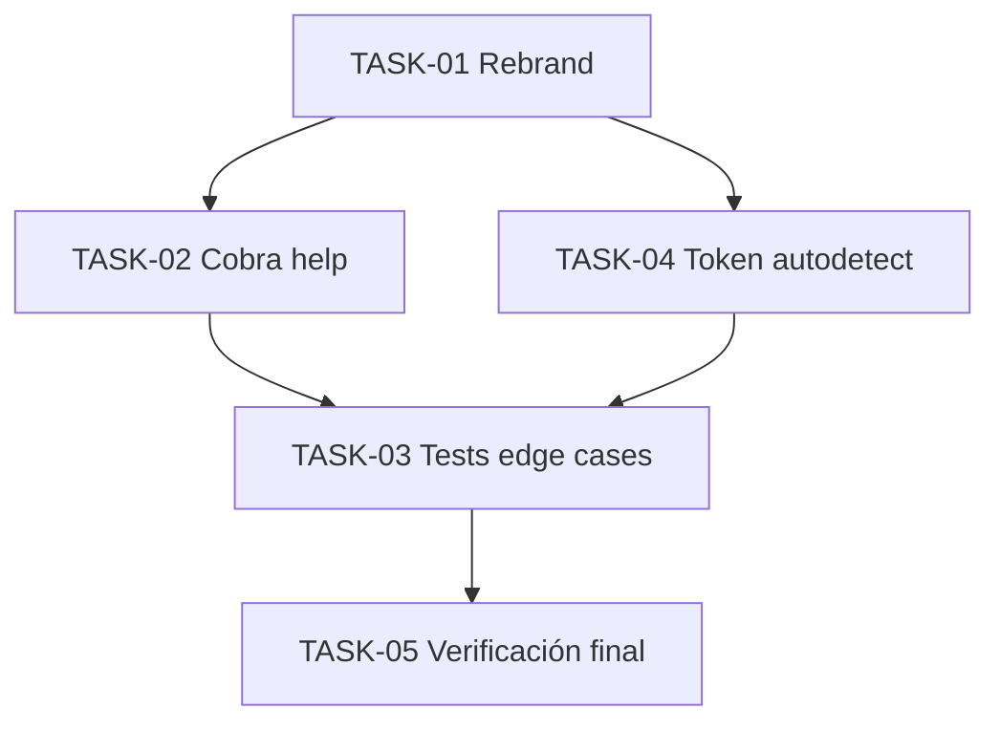

# Backlog MooFetch (rebranding + calidad + autodetección de token)

Arquitectura objetivo: [../architecture.md](../architecture.md). Decisiones: [ADR 003](../adr/003-deteccion-automatica-de-token.md), [ADR 004](../adr/004-rebranding-moofetch.md).

| Tarea | Estado |
| :--- | :---: |
| [TASK-01 Rebranding a MooFetch](TASK-01-rebrand-moofetch.md) | [x] |
| [TASK-02 Limpieza de ayuda Cobra](TASK-02-cobra-help-cleanup.md) | [x] |
| [TASK-03 Tests de casos borde y QoL](TASK-03-unit-tests-edge-cases.md) | [x] |
| [TASK-04 Autodetección de token](TASK-04-token-autodetect.md) | [x] |
| [TASK-05 Verificación final](TASK-05-final-verification.md) | [x] |

Reglas para agentes: no hacer commits salvo petición; TASK-02 y TASK-04 tocan `root.go`/`form.go`, por lo que se ejecutan en worktrees aislados; marcar el checkbox al terminar.
